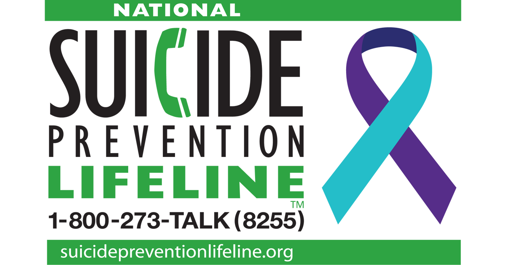

```{r setup, include=FALSE}
knitr::opts_chunk$set(echo = FALSE, message = FALSE, warning = FALSE)
suicide.data <- read.csv("Data/Suicide_Rates.csv")
```

## Further Analysis

Upon analyzing the dataset, we have noticed a notable pattern of high suicide 
rates in South Africa and Latin America, specifically countries such as Lesotho,
Swaziland, and Guyana.This pattern can be observed by using the **'World Map'** 
because it shows those countries with the darkest red color that signifies 
extremely high rates of suicide. Those rates are specifically 87.5 per 100,000
people, 40.5 per 100,000 people, and 40.9 per 100,000 people, respectively in 
the year 2019. Another interesting pattern to note is that in Lesotho, female 
suicide rates were greater than male suicide rates, to which globally was 
always the one that was typically higher. Russia can also be seen to start with 
extremely high rates of suicide but shows a consistent decrease over the years.

A few broader implications of this insight can be due to several reasons: 

- Lack of mental health support. There continues to be stigma and negative 
connotations mentally ill or struggling individuals. Going through depression 
or any other disorders could make these people feel alienated and lonely, which 
makes it easier to spiral into contemplating suicide.

- Economic/financial stability. These countries are also referred to as
"third-world" countries and majority of the population lives in poverty and
struggle to provide for themselves or their families. 

- Suicidal ideation rates is proportionate to suicide rates, and within these
countries the suicidal ideation rates begin at very young ages among children,
who later on develop even greater mental health and support issues as they grow
older. Numerous factors can influence suicidal ideation rates, such as social 
life, food security, age, gender, use of drugs, parental understanding of 
mental illness, and many more.


### Data Quality + Future Ideas

The quality of this dataset seems to be reasonable, especially considering the 
source is from the World Health Organization, which is a reputable resource and 
notorious for collecting unbiased data. However, there is a possibility that the 
results of the data will give a biased conclusion due to lack of context and 
meaning behind the numbers. It is hard to understand for what reason these 
suicide rates are so high without properly researching and observing what is 
happening within each country. However, this dataset raises awareness of 
populations that are struggling with suicide, and sheds light 
to mental health disparities and the consequences of those issues.

In terms of future ideas and how this project can be advanced further, it would 
be a great idea to include more factors such as mental health resources available, 
drug use, and financial stability so that we can observe these patterns in 
greater depth.


